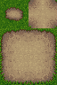

LÖVE Autotile
=============

Autotile creates tiles that automatically pick an appropriate texture from an
atlas based on the collision around the tile.

Usage
=====

To use autotile, you need three things:

    local autotile = require('autotile')

    -- 1. An image in this specific format.
    local autotile_image = love.graphics.newImage("Autotile.png") -- Autotile image
    local tile_pixel_width = 32
    local tiler = autotile(autotile_image, tile_pixel_width)

    -- 2. A 2-d grid used to represent connected tiles. Values can either contain true for
    -- connected tiles or nil for unconnected tiles.
    local grid = {}

    -- 3. Code to draw the tiles.
    function love.draw()
        for x = 0, math.ceil(love.graphics.getWidth() /size) do
            for y = 0, math.ceil(love.graphics.getHeight() /size) do
                if grid[x] and grid[x][y] then
                    tiler:drawAutotile(grid,x,y)
                end
            end
        end
    end

See [this post by Kadoba](https://love2d.org/forums/viewtopic.php?t=7826) for more information.

Credits
=======
Autotile is based on code [written by Kadoba from the love
forums](https://love2d.org/forums/viewtopic.php?t=7826). Adapted for
use as a library by idbrii.
